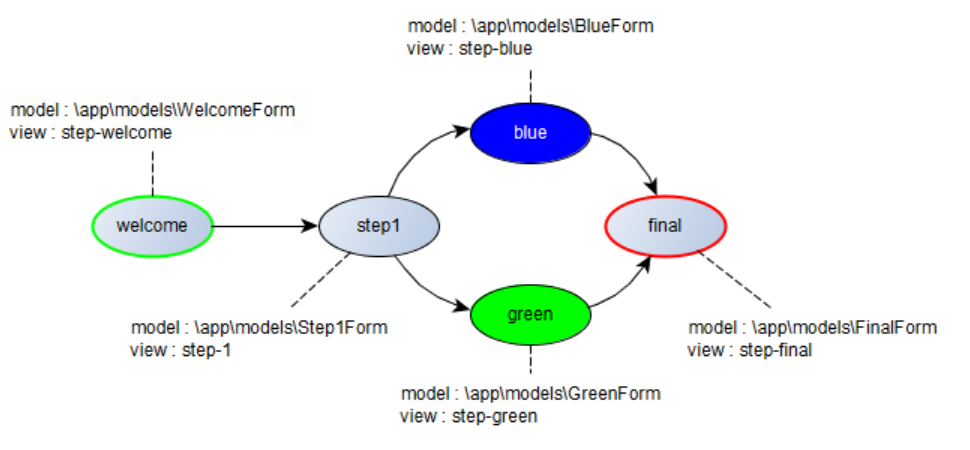

THIS IS A **PROOF OF CONCEPT** THAT DEMONSTRATE HOW TO IMPLEMENT THE WIZARD UI PATTERN ON TOP OF THE **YII2-WORKFLOW** EXTENSION.

**For the TLDR ones, checkout the [demo](http://raoul2000.good-gamer.net/index.php?r=workflow/wizflow/init).**

Need more information about **yii2-workflow** please refer to the [User Guide](http://raoul2000.github.io/yii2-workflow/).


# A Wizard Implementation

The word *wizard* does not only refers to some Gandalf guy or any other old man wearing a funny hat and loaded with super magic power. In the world of user interface a wizard is a design pattern that can be applied in the case where *the user wants to achieve a single goal which can be broken down into dependable sub-tasks* (from [ui-patterns.com](http://ui-patterns.com/patterns/Wizard)).

To learn more about wizard, see [Designing Interfaces](http://designinginterfaces.com/patterns/wizard/).

## The problem

The problem is simple : how can we implement a complex step-by-step process that will guide the user to its final goal ? The complexity can come from the fact that depending on the choice made by the user, he/she can be guided through different steps (conditional branching). In other words, we are considering a case where there would be several path (ordered sequence of steps) to go from the first step to the last one (the goal).

The purpose of this Yii2 extension is to solve this problem using the workflow paradigm implemented by **yii2-workflow** extension.

## The Wizflow Solution

### Workflow Definition
A workflow can be viewed as a representation of all possibles steps that the user has to perform for navigate through a wizard widget. So, why not simply define a workflow representing all possible path of our wizard ? We could also use the **metadata** attributes provided by *yii2-workflow* to associate some data with each steps of our wizard (each *status* of our workflow).

We need :
- the model name
- the view name

Let's see that on a very basic wizard that will ask stupid questions  to the user (like for instance *"what color do you prefer between green and blue"*) and depending on her reply, perform the corresponding transitions. On a more linear use case, we will also be able to go from one step to the other.

Here is our *wizflow* :



As you can see, the status *step1* is associated with a Yii2 model that contains attributes the user must select, and a Yii2 view name that represent the form to display to the user.

Defining the wokflow definition for this wizflow is easy : [check this out](https://github.com/raoul2000/yii2-wizflow/blob/master/example/models/Wizflow.php).

Read more about [Workflow Definition](http://raoul2000.github.io/yii2-workflow/workflow-creation/).

### The Wizflow Manager

Now last thing is a component able to navigate through this wizflow, based on user inputs and the current step (i.e. status). This component is the **WizflowManager**. The one provided with this extension is also responsible for path persistence, that is keep track of all successive steps the user has performed through the wizflow (a very basic session storage persistence is implemented).

If you take a look to the *[WizflowManager](https://github.com/raoul2000/yii2-wizflow/blob/master/src/WizflowManager.php)* code, you will see that the **getNextStep** method is in charge of providing the next status the user will reach when the button *NEXT* is pushed. To define what is the next step, the *WizflowManager* invokes the `SimpleWorkflowBehavior.getNextStatuses(true,true)` method which includes model validation. If more than one next step (next status) is available, the first one is used: **it is the developper responsability to make sure that validation rules and transitions only allow one next step**.

In the example included in the *yii-wizflow* extension the workflow above is configured. This workflow includes a branching between *step1* and the *blue* or *green* status. Depending on the user input, the validation rules must be exclusive in order to only select on possible destination :

- if the user select "blue" as favorite color, the next step is "blue"
- if the user select "green" as favorite color, the next step is "green"

That's the way branching in handled : validation rules applied at a given step should be configured in order to select **only one destination** as the *next step*. Again, this is developer responsability to ensure this is done correctly.

Read more about the [Workflow Driven Attribute validation](http://raoul2000.github.io/yii2-workflow/concept-validation/).

# Install Examples

The *yii2-wizflow* extension comes with a set of Yii2 models, controller and views dedicated to override the **basic Yii2 application template** and demonstrate yii-wizflow in action.

Here is a summary of commands to run to install the example Wizflow application. You'll find a detailed description below.

```
composer global require "fxp/composer-asset-plugin:~1.1.1"
composer create-project yiisoft/yii2-app-basic wizflow 2.0.9
cd wizflow
composer require raoul2000/yii2-wizflow:@dev
cp vendor/raoul2000/yii2-wizflow/example/* .
```

To install this demo app you must :

- create a new yii2 application based on the **basic** template. To do so, follow [Yii2 installation guide](http://www.yiiframework.com/download/)
- install the *yii2-wizflow* extension
- override all folders at the root of your yii2 app with the ones provided in `vendor/raoul2000/yii2-wizflow/example`

If you already have a running Yii2 application based on the *basic* template, here are the steps you can perform manually:

- declare the **WizflowManager** component in `APP_FOLDER/conf/web.php`. This component implements all the logic between the workflow definition and model/view. It also handle the persistence layer by saving user entries into the current session.

```php
'components' => [
  'wizflowManager' => [
    'class' => '\raoul2000\wizflow\wizflowManager'
  ],
  // etc ...
```

- declare the **workflowSource** component in `APP_FOLDER/conf/web.php`. This is the standard yii2-wizflow source component.

```php
'components' => [
  'workflowSource' => [
    // use default settings : workflow definition is stored in an object and can be
    // retrieved with the getDefinition() method
    'class' => '\raoul2000\workflow\source\file\WorkflowFileSource'
  ],
// etc ...
```
- add a new action in `APP_FOLDER/controllers/SiteController.php`. This action is used during wizard navigation.

```php
public function actions()
{
    return [
      // other actions ...
        'wizflow' => [
            'class' => '\raoul2000\wizflow\WizardPlayAction'
        ],
    ];
}
```
- add the *finish* action in `APP_FOLDER/controllers/SiteController.php`. This action is invoked at the end of the wizard, to display a summary of choices made by the user.

```php
public function actionFinish()
{
  return $this->render('finish',[
    'path' => Yii::$app->wizflowManager->getPath()
  ]);
}
```

- navigate to [http://hostname/index.php?r=site/wizflow](http://host/index.php?r=site/wizflow)
- enjoy
